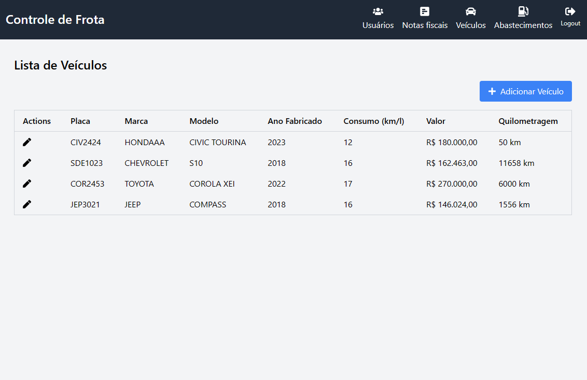
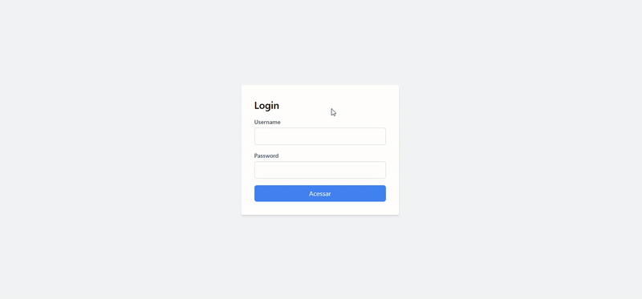
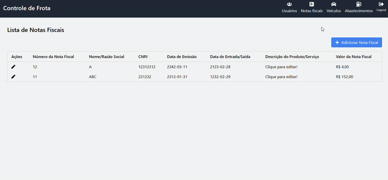
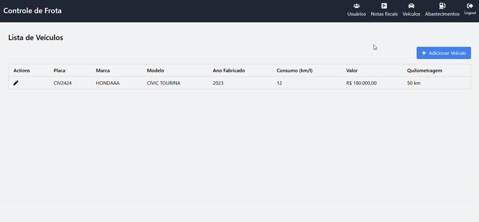

<h1 align="center">
  Frota Frontend
</h1>

  <a href="#-tecnologias">Tecnologias</a>&nbsp;&nbsp;&nbsp;|&nbsp;&nbsp;&nbsp;
  <a href="#-projeto">Projeto</a>&nbsp;&nbsp;&nbsp;|&nbsp;&nbsp;&nbsp;
  <a href="#-layout">Layout</a>&nbsp;&nbsp;&nbsp;|&nbsp;&nbsp;&nbsp;
  <a href="#-como-executar">Como executar</a>&nbsp;&nbsp;&nbsp;|&nbsp;&nbsp;&nbsp;
  <a href="#-executando-a-aplicação">Executando a aplicação</a>&nbsp;&nbsp;&nbsp;|&nbsp;&nbsp;&nbsp;
  <a href="#-backend">Backend</a>

## 🚀 Tecnologias

Esse projeto foi desenvolvido com as seguintes tecnologias:

- [Next JS](https://nextjs.org)    

- [TypeScript](https://www.javascript.com/)    

## 💻 Projeto

Frota é um projeto que consome uma API feita em Spring boot. Esse projeto contém um sistema de autenticação, e é possível cadastrar e visualizar os dados de usuários do sistema, veiculos e abastecimentos.

## ✨ Layout

  

## 🔖 Como executar

- Clone o repositório
- Instale as dependências com `npm`
- Inicie o servidor com `npm run start`

Agora você pode acessar [`localhost:3000`](http://localhost:3000) do seu navegador.

## 🎬 Executando a aplicação

  

  

  

## ⚙️ Backend 

- [Frota-API](https://github.com/ArthurHab/frota-api)    
